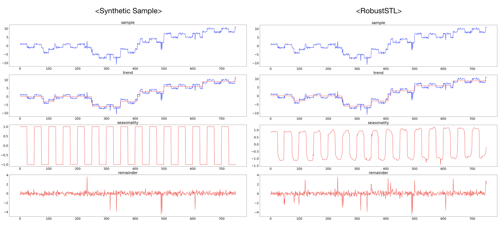

# RobustSTL: A Robust Seasonal-Trend Decomposition Algorithm for Long Time Series (AAAI 2019)
This repository contains python (3.5.2) implementation of RobustSTL ([paper](https://arxiv.org/abs/1812.01767))  . 

Decomposing complex time series into trend, seasonality, and remainder components is an important task to facilitate time series anomaly detection and forecasting.  
RobustSTL extract trend using LAD loss with sparse regularization and non-local seasonal filtering.  
Compared to previous approaches (such as traditional STL), RobustSTL has advantages on  
1) Ability to handle seasonality fluctuation and shift, and abrupt change in trend and reminder  
2) robustness of data with anomalies  
3) applicability on time series with long seasonality period.  

## Requirments & Run
First, install some required libraries using pip.
```
pip3 install -r requirments.txt
python3 main.py
```

## Sample Results 
We generate a synthetic sample (sample_generator.py) and decompose it into `trend`, `seasonality`, and `remainder`.
In `run_example.ipynb`, I attach the example codes to use RobustSTL and the outputs.

 

## Codes
* `main.py` : run example code
* `RobustSTL.py`: contains RobustSTL algorithm and each process.
* `utils.py`: common utility functions
* `sample_generator.py`: generation codes of synthetic sample.
* `l1.py` : optimizer of l1 norm approximation (source: cvxopt)

## Arugments of RobustSTL
- input : input series
- season_len : length of seasonal period
- reg1 : first order regularization parameter for trend extraction
- reg2 : second order regularization parameter for trend extraction
- K : number of past season samples in seasonality extraction
- H : number of neighborhood in seasonality extraction
- dn1, dn2 : hyperparameter of bilateral filter in denoising step.
- ds1, ds2 : hyperparameter of bilarteral filter in seasonality extraction step.

## Shape of input sample
Basically, RobustSTL is for univariate time series sample.  
However, this codes are available on multi-variate time series sample.
(It apply the algorithm to each series, using multiprocessing)
Each series *have to* have same time length.

* Univariate Time Series: `[Time] or [Time,1]`
* Multivariate Time Series: `[N, Time] or [N, Time, 1]`

## Etc
The original paper has wrong notation in seasonality extraction.  
The difference is [log](https://github.com/LeeDoYup/RobustSTL/commit/99a801525eca59469b0a314dd17fdd798c477c6d)
